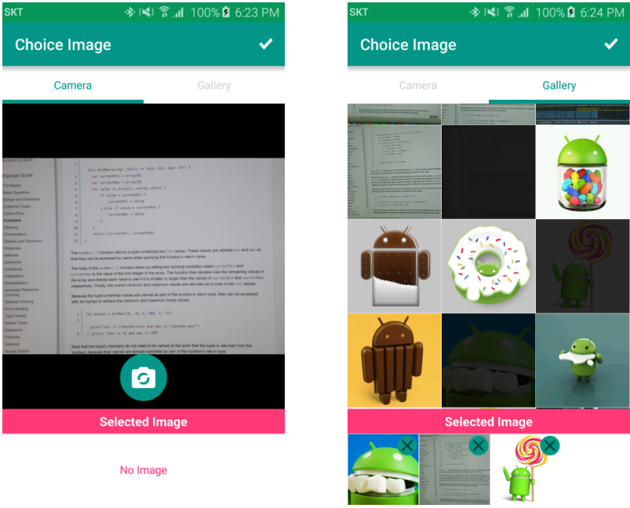
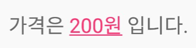

Android 유용한 정보
================
#### Source에 간단한 소스 설명 & 이미지가 들어있음

목록
------
+ [TedPermission 설명 페이지](http://gun0912.tistory.com/61)
+ [TedPermission Github 페이지](https://github.com/ParkSangGwon/TedPermission)
+ [Glide Github 페이지](https://github.com/bumptech/glide)
+ [Glide-transformations Github 페이지](https://github.com/wasabeef/glide-transformations)
+ [Core Github 페이지](https://github.com/wasabeef/awesome-android-libraries)
+ [UI/UX Github 페이지](https://github.com/wasabeef/awesome-android-ui)
+ [APK파일 디컴파일하기](https://m.blog.naver.com/PostView.nhn?blogId=goodsogi&logNo=220654395243&proxyReferer=https:%2F%2Fwww.google.co.kr%2F)
+ [MMS 문자 전송](http://mashroom.tistory.com/17)
+ [FileProvider](http://egloos.zum.com/mightyfine/v/315645)
+ [AQuery 설명 페이지](http://egloos.zum.com/mightyfine/v/307168)
+ [TedPicker Github 페이지](https://github.com/ParkSangGwon/TedPicker)
+ [spannable 설명 페이지](http://sub-dev.tistory.com/10)
+ [BLE 통신 라이브러리](https://github.com/jjongkwon2/BluetoothLibrary)

Permission 권한체크 라이브러리
-------------------------
> Android 6.0 (마시멜로우) 버전부터 사용자들의 권한을 허가받아야하는 규칙이 생김.
> 일일히 구현하기가 상당히 귀찮았으나 TedPermission 라이브러리를 사용하면
> 상당히 간단하게 권한체크를 사용할 수 있음!
> + [TedPermission 설명 페이지](http://gun0912.tistory.com/61)
> + [TedPermission Github 페이지](https://github.com/ParkSangGwon/TedPermission)

이미지 라이브러리
-------------
> 이미지 처리 라이브러리
> + [Glide Github 페이지](https://github.com/bumptech/glide)

> 이미지 변형 라이브러리
> + [Glide-transformations Github 페이지](https://github.com/wasabeef/glide-transformations)

Core 라이브러리
------------
> 네트워킹, 이미지로더, JSON, Logger, Video, Fonts...
 핵심 기능이 있는 라이브러리의 링크를 적어놓은 깃허브 페이지
> + [Core Github 페이지](https://github.com/wasabeef/awesome-android-libraries)

UI/UX 라이브러리
-------------
> Material, Layout, Button, Image, Animation, Effect...
 이쁜 디자인과 애니메이션을 구현해놓은 라이브러리들을 모아놓은 깃허브 페이지
> + [UI/UX Github 페이지](https://github.com/wasabeef/awesome-android-ui)

Decompile
---------
> 안드로이드 APK 파일을 디컴파일 하는 방법
 예전에 구글에서 만든 프로젝트를 디컴파일 해봤으나
 굉장한 난독화로 인하여 결국 고생만 함..
> + [APK파일 디컴파일하기](https://m.blog.naver.com/PostView.nhn?blogId=goodsogi&logNo=220654395243&proxyReferer=https:%2F%2Fwww.google.co.kr%2F)

MMS 문자 & Email
---------------
> 이미지가 담긴 MMS문자 전송을 구현하기 위해 찾은 페이지

> 출처: http://mashroom.tistory.com/17 [MashRoom]
> + [MMS 문자 전송](http://mashroom.tistory.com/17)

파일관련 보안 문제
------
> 카메라 관련 작업을 하다가 파일을 저장하기 위해 Uri를 생성하다가
 오류가 떠서 실행이 안되는 경우가 발생
 Uri를 생성할 때 FileProvider를 사용해야 함을 발견!
> + [FileProvider](http://egloos.zum.com/mightyfine/v/315645)

뷰 관련 유용한 라이브러리
-------------------
> 이미지뷰에 이미지를 넣거나 텍스트뷰에 글자, 사이즈, 색상을 쉽게 설정할 수 있다.
> + [AQuery 설명 페이지](http://egloos.zum.com/mightyfine/v/307168)
> + [androidquery github 페이지](https://github.com/androidquery/androidquery)

카메라 & 앨범에서 이미지 선택
----------------------
> 카메라 혹은 갤러리에서 이미지를 선택하는 라이브러리
> + [TedPicker Github 페이지](https://github.com/ParkSangGwon/TedPicker)
> + 

텍스트뷰에 밑줄 추가
----------------
> 텍스트뷰에 밑줄을 추가하고 색깔을 넣는 기능
> + [spannable 설명 페이지](http://sub-dev.tistory.com/10)
> + 

블루투스 라이브러리
--------------
> 내가 직접 만든 블루투스 BLE 통신 라이브러리
> 사용감에 약간 불편한감이 없지않아 있지만 개선 중입니다.
> + [BLE 통신 라이브러리](https://github.com/jjongkwon2/BluetoothLibrary)
