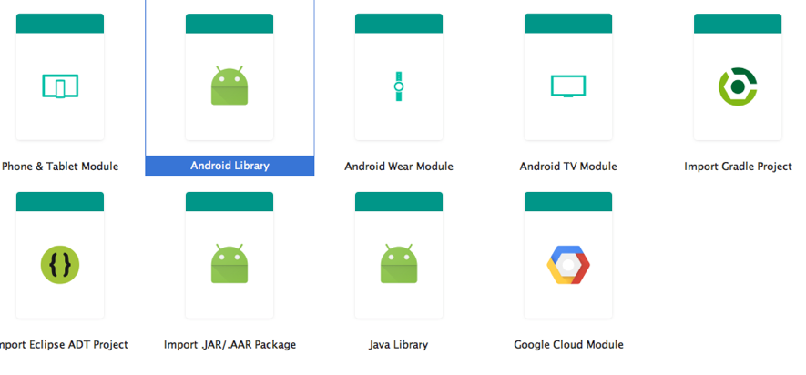
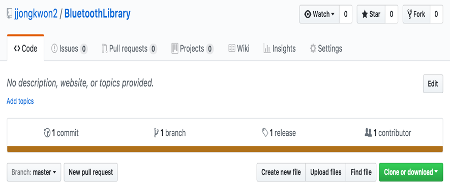

# 안드로이드 라이브러리 제작 및 배포

#### 1. 라이브러리 생성
New Module -> Android Library -> OK


#### 2. 라이브러리 제작

#### 3. Github 프로젝트 생성 후 push

#### 4. Release , 버전 등록


#### 5. Jitpack을 사용하여 배포
[Jitpack](https://jitpack.io/)

#### 6. Android Studio에서 해당 라이브러리 적용 방법
1. maven jitpack 추가
``` xml
  allprojects {
    repositories {
      ...
      maven { url 'https://jitpack.io' }
    }
  }
```

2. dependencies 추가
``` xml
  dependencies {
    compile 'com.github.User:Repo:Tag'
  }
```
 example
``` xml
  compile 'com.github.jjongkwon2:BluetoothLibrary:1.0.1'
```
